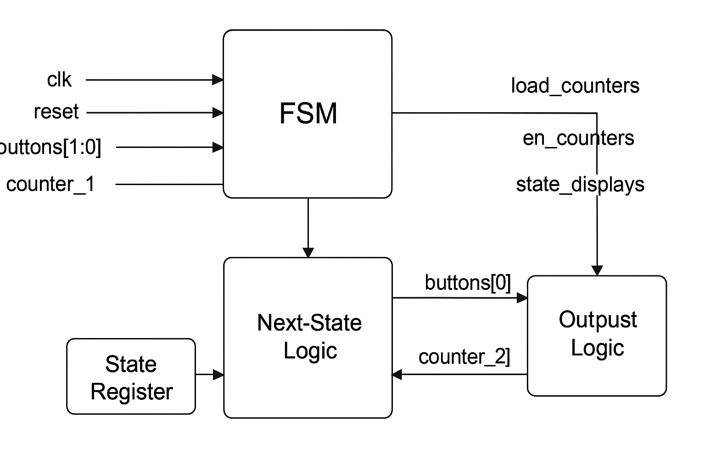

# 🧠 **Lab Report: Finite State Machine (FSM) -- Chess Timer**

## 🔍 **Objective**

The purpose of this lab is to design and implement a **Finite State
Machine (FSM)** that controls a **two-player chess timer**.\
Each player's timer counts down while it's their turn. Pressing the
button switches control between players.\
When a player's time runs out, the system enters an **END** state.

## ⚙️ **Overview**

This FSM is a **Moore-type machine** implemented in **Verilog**, where
outputs depend only on the current state.\
It manages four major states: 1. **IDLE** -- system ready, both timers
are loaded\
2. **PLAYER1** -- Player 1's timer counts down\
3. **PLAYER2** -- Player 2's timer counts down\
4. **END** -- game ends when a timer reaches zero


## **Block Diagram**



## 🧩 **Module Declaration**

``` verilog
`default_nettype none

module FSM_ChessTimer(
    input clk,
    input reset,
    input [1:0] buttons,         // buttons[0] = Player 1, buttons[1] = Player 2
    input [9:0] counter_1,
    input [9:0] counter_2,
    output reg [1:0] load_counters,
    output reg [1:0] en_counters,
    output reg [1:0] state_displays
);
```

### Explanation

-   `clk` → System clock signal.\
-   `reset` → Resets the FSM to the initial state.\
-   `buttons` → Two buttons used by players to switch turns.\
-   `counter_1` and `counter_2` → Represent the time left for each
    player.\
-   `load_counters` → Used to load initial time values.\
-   `en_counters` → Enables counting for one player at a time.\
-   `state_displays` → Controls display output (e.g., "OG", "Pend").

## 🔢 **State Encoding**

``` verilog
    localparam IDLE    = 2'b00;
    localparam PLAYER1 = 2'b01;
    localparam PLAYER2 = 2'b10;
    localparam END     = 2'b11;
```

  State Name   Binary Code   Description
  ------------ ------------- -----------------------
  IDLE         `00`          Wait for player input
  PLAYER1      `01`          Player 1's turn
  PLAYER2      `10`          Player 2's turn
  END          `11`          Game over

## 🔄 **1. State Register (Sequential Logic)**

``` verilog
    reg [1:0] state, next_state;

    always @(posedge clk or posedge reset) begin
        if (reset)
            state <= IDLE;
        else
            state <= next_state;
    end
```

This always block updates the current state on each clock cycle. When
reset is active, FSM goes back to IDLE.

## 🧠 **2. Next-State Logic (Combinational Logic)**

``` verilog
    always @(*) begin
        case (state)
            IDLE: begin
                if (buttons[0])
                    next_state = PLAYER1;
                else if (buttons[1])
                    next_state = PLAYER2;
                else
                    next_state = IDLE;
            end

            PLAYER1: begin
                if (counter_1 == 10'd0)
                    next_state = END;
                else if (buttons[1])
                    next_state = PLAYER2;
                else
                    next_state = PLAYER1;
            end

            PLAYER2: begin
                if (counter_2 == 10'd0)
                    next_state = END;
                else if (buttons[0])
                    next_state = PLAYER1;
                else
                    next_state = PLAYER2;
            end

            END: begin
                if (reset)
                    next_state = IDLE;
                else
                    next_state = END;
            end

            default: next_state = IDLE;
        endcase
    end
```

This block decides which state to go to next based on input conditions.

## 💡 **3. Output Logic (Combinational Logic)**

``` verilog
    always @(*) begin
        load_counters   = 2'b00;
        en_counters     = 2'b00;
        state_displays  = 2'b00;

        case (state)
            IDLE: begin
                load_counters   = 2'b11;
                en_counters     = 2'b00;
                state_displays  = 2'b00;
            end

            PLAYER1: begin
                en_counters     = 2'b01;
                state_displays  = 2'b01;
            end

            PLAYER2: begin
                en_counters     = 2'b10;
                state_displays  = 2'b01;
            end

            END: begin
                state_displays  = 2'b10;
            end
        endcase
    end
```

## 🧾 **State Diagram (Description)**

         +-------+
         | IDLE  |
         +-------+
           |  buttons[0]
           v
       +-----------+          +-----------+
       | PLAYER1   |<-------->|  PLAYER2  |
       +-----------+          +-----------+
           | counter_1==0          | counter_2==0
           v                       v
          +------ GAME END ------+
          |         END          |
          +----------------------+

## ✅ **Conclusion**

This FSM successfully models a two-player chess timer that alternates
turns, detects timeouts, and displays state status.
